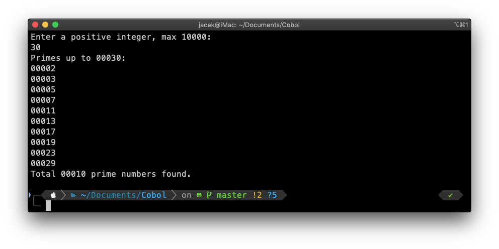

# COBOL

Small repo with my test programs in Cobol.

Get GnuCOBOL from [SourceForge](https://sourceforge.net/p/open-cobol/wiki/Home/).

All programs should compile with:

```bash
cobc -free -x -o program_name.cbl
```

Add `-fdebugging-line` flag, if you want to see extra debug messages.

## prime.cbl


I skip *Hello, world!* and did this as my first COBOL program. Blast from past, as this was the first algorithm I programed 30+ years ago, while learning *Action!* on my 8-bit Atari.

Generic implementation of [Sieve of Eratosthenes](https://en.wikipedia.org/wiki/Sieve_of_Eratosthenes). Finds all prime numbers up to given limit. Basic sanity checks on user entry. Arbitrary maximal limit set to 10000.

## wordstat.cbl


Test of file and table operations. Program reads plain text file, and counts words within. Displays 15 most popular. Program accepts filename as parameter. If not provided, falls back to default `south.txt`, which needs to be in the same directory.

```bash
wordstat my_text_file.txt
```

COBOL hardly processes unstructured files, it's bit of a challenge to dynamically process random data. I cut some corners with hard-coding the limit of words in final dictionary, maximal size of word, size of single line. No idea if this is acceptable COBOL practice. Definitely, something to use a database for.

