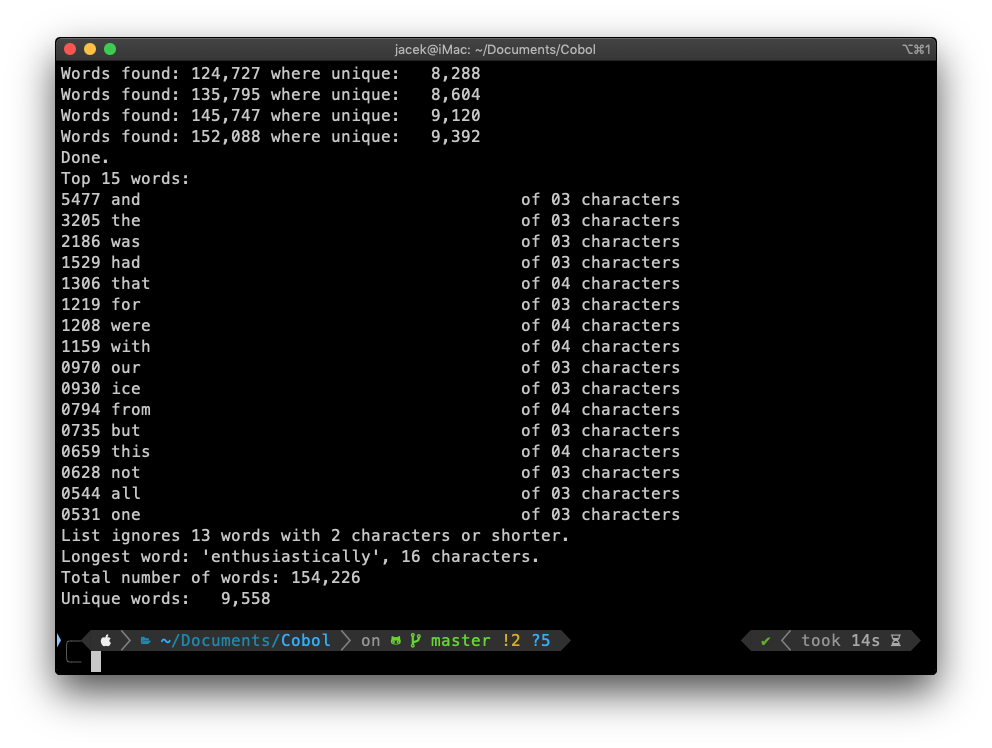
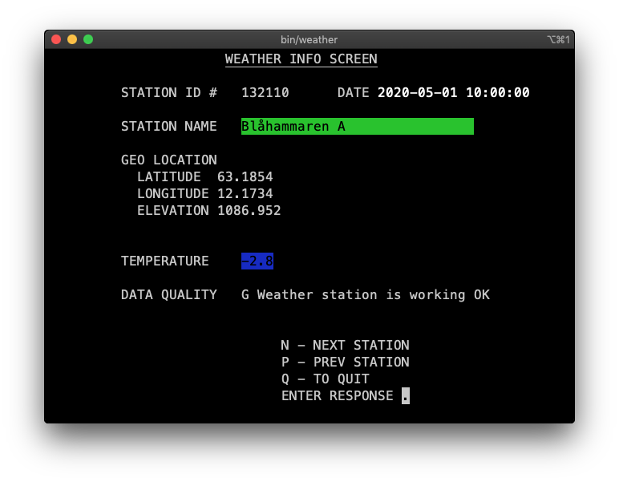
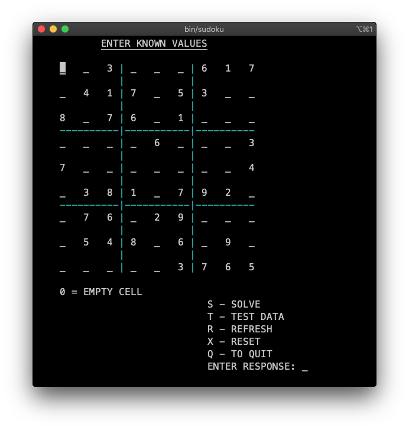

# COBOL

Small repo with my test programs in Cobol.

Get GnuCOBOL from [SourceForge](https://sourceforge.net/p/open-cobol/wiki/Home/).

All programs should compile with:

```bash
cobc -free -x -o program_name.cbl
```

Add `-fdebugging-line` flag, if you want to see extra debug messages. If you have `make` installed, compile process is simplified to:

```bash
make program
```

Executables will be created in local `bin` directory.

## prime.cbl


I skip *Hello, world!* and did this as my first COBOL program. Blast from past, as this was the first algorithm I programmed 30+ years ago, while learning *Action!* on my 8-bit Atari.

Generic implementation of [Sieve of Eratosthenes](https://en.wikipedia.org/wiki/Sieve_of_Eratosthenes). Finds all prime numbers up to given limit. Basic sanity checks on user entry. Arbitrary maximal limit set to 10000.

## wordstat.cbl



Test of file and table operations. Program reads plain text file, and counts words within. Displays 15 most popular. Program accepts filename as parameter. If not provided, falls back to default `south.txt`, which needs to be in the same directory.

```bash
wordstat my_text_file.txt
```

COBOL hardly processes unstructured files, it's bit of a challenge to dynamically process random data. I cut some corners with hard-coding the limit of words in final dictionary, maximal size of word, size of single line. No idea if this is acceptable COBOL practice. Definitely, something to use a database for.

## weather.cbl



First approach to *full screen* program, with proper user interface, dynamic colouring, etc. Displays weather information from sensors in Sweden. Weather info based on data from [SMHI](https://smhi.se).

Data source is CSV file `weather.csv`. Program acquires the file by calling external program `weather.sh`, which is just a trivial `bash` script downloading fresh data from SMHI.

Link to data source via [API](https://opendata-download-metobs.smhi.se/api/version/1.0/parameter/1/station-set/all/period/latest-hour/data.csv).

## sudoku.cbl



Another full screen application. Solves sudoku, using independent programs linked statically. One of them is run recursively, to get sudoku solutions. If sudoku has more than one, program will display all solutions in sequence.

Basic logic, does not prevent overloading recurrent calls with unsolvable sudoku. Entry screen is not checking against mistakes. For its clarity, solving algorithm is without major optimizations, yet it's blazingly fast.

Most of the work in this coding went to screen design (even if you don't see that). If I ever code full screen app again with so many objects on screen I would build own tool to design screens and produce source code for `SCREEN SECTION`. Code uses `COPY` functionality to share common pieces between programs.
